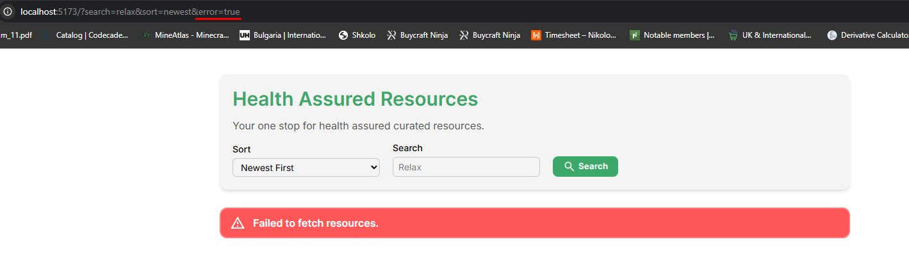

# Health Assured Take-Home Assignment - Kristian Dimitrov

This project demonstrates how fetching, organising, and caching resources can be implemented using modern React features. For this project, the sorting of resources based on category/date and filtering by title/tags have been implemented.

## Tech Stack

- TypeScript
- React
- React Query
- React Router
- Tailwind
- Vitest
- React Testing Library

## Installation

1. Clone the repository and install dependencies:

```bash
git clone <repository-url>
cd health-assured-task
npm install
```

2. Start the development server:

```bash
npm run dev
```

3. Run all tests

```bash
npm run test
```

4. Run a particular test file

```bash
npm test <test-file-name>
```

5. Build for production

```bash
npm run build
```

6. Preview the production build

```bash
npm run preview
```

## Project Structure

```text
.
├── src/
│   ├── components/
│   │   ├── atoms/
│   │   ├── molecules/
│   │   └── organisms/
│   ├── data/
│   ├── hooks/
│   ├── pages/
│   ├── types/
│   └── utils/
└── README.md
```

The project component structure closely follows Atomic Design principles where the reusable components are separated in folders based on their size and complexity. This can be seen in the **components** folder.

The **data** folder contains a JSON file, which provides the application with the mock data retrieved from the fake API.

The **hooks** folder is intended to provide reusable functionality to the components. For the completion of the project, only 1 hook needed to be developed, which is responsible for the fetching of resources from the fake API and providing the components with information about the state of the current query.

For this project, the **pages** folder contains only 1 page, which has been the focus of this assignment.

In the **types** folder, types that are used across the application can be found.

The **utils** folder contains functions responsible for the fetching, filtering sorting and grouping of resources and their respective tests.

### Assumptions

It has been assumed that further work could involve calling an external API with query parameters. For this reason the parameters stay updated with the search and sorting preferences of the user.

It was also assumed that such a project could gradually increase in complexity. For a project of this scale, following the atomic components structure is not necessary, but following it from the start for any project scales better when more components need to be added in the future. Another such example is the hooks folder which contains a single hook and the pages folder which contains a single page.

### Design Decisions

TypeScript, the React framework, React Query and React Router were used for this task as they provide type-safety, rapid development, caching of previously-fetched data and easy editing of query parameters. No global state management implementation was needed as the the only state that had to be accessed from multiple components could be stored in the query parameters and accessed using **useSearchParams** hook provided by React Router.

Test Driven Development was followed for more complex parts of the application using Vitest and React Testing Library. Unit tests have been written for the functions responsible for the filtering, sorting and grouping of resources and can be found in the utils folder. React Testing Library was used for the testing of the more-complex components and can be found in the components -> organisms folder.

The above-mentioned error state can be toggled by either adding "error=true" as a query parameter, or setting the "shouldFail" flag to true in the fetchResources.ts file. This state was added to simulate failure in the retrieval of resources from an external API.


## Further Work

The feature "When a user clicks on a resource, display all the resource data including the description and date uploaded" was not developed and should be implemented.

Testing should expand to include the prepareResources function which combines filtering, sorting and grouping and is directly consumed by the Categories component. Additionally, the error state of the application (which simulates failure in the fetching of resources) should also be tested.

Some of the more complex CSS styling can be found in the index.css file, while most of the styling has directly been added as inline tailwind classes. While the developer prefers such an approach because it makes the development of various hover and focus element states easier, it can be argued that having all of the CSS in one place is a more consistent approach.

The mobile layout of the application should also be implemented.
